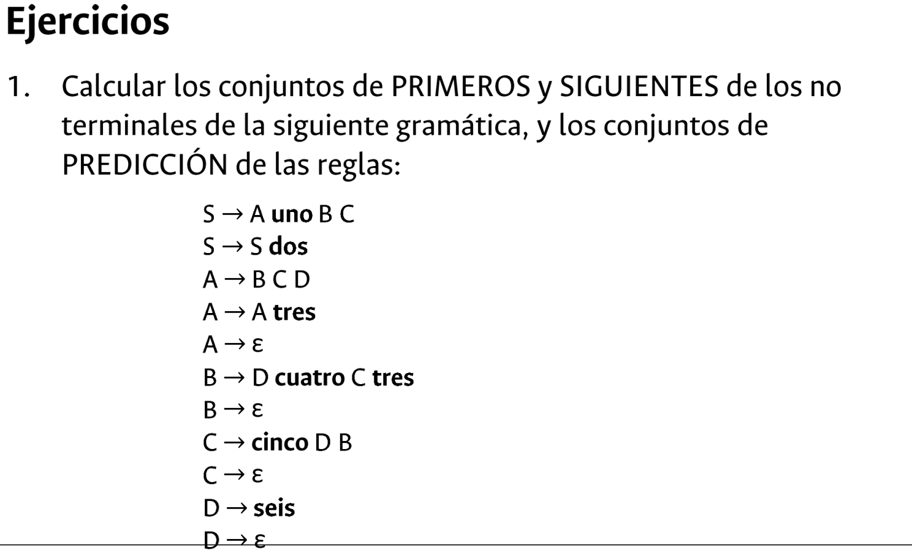
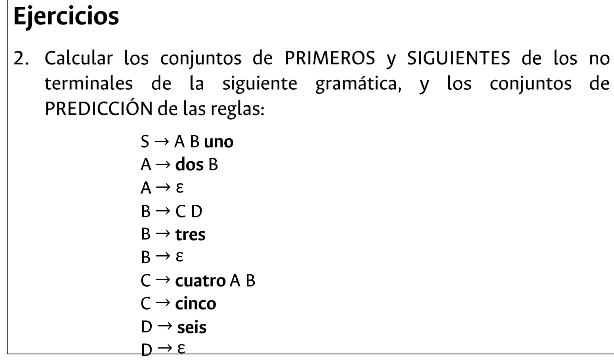
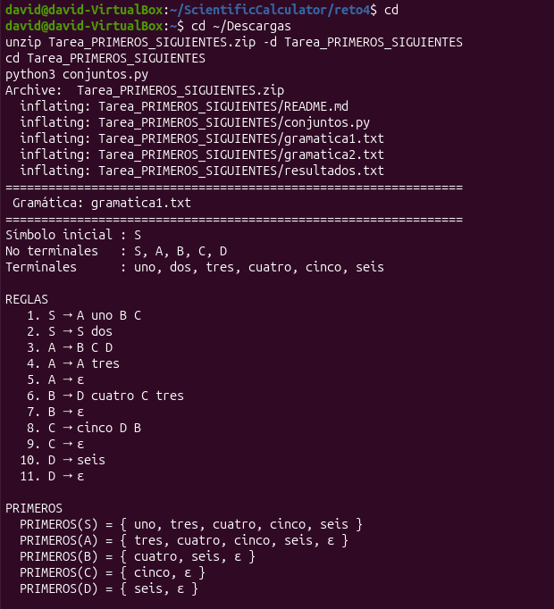
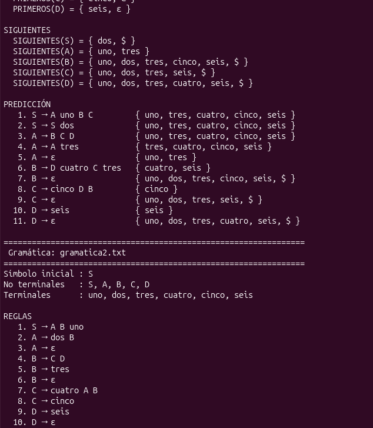
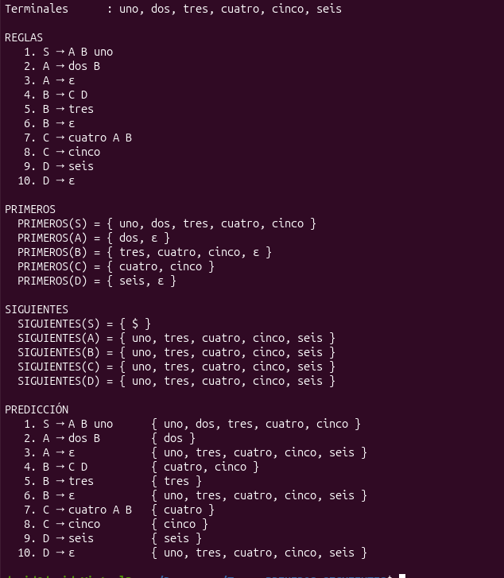

# Conjuntos PRIMEROS, SIGUIENTES y PREDICCIÓN — análisis sintáctico descendente

**Universidad Sergio Arboleda** · Facultad de Ingeniería en Ciencias de la Computación e IA
**Materia:** Lenguajes de Programación y Traducción
**Estudiante:** David Andrés Castellanos Angulo

📄 **Informe completo:** [`docs/informe_primeros_siguientes.pdf`](docs/informe_primeros_siguientes.pdf)

## Enunciado

Calcular los conjuntos PRIMEROS y SIGUIENTES de los no terminales de dos gramáticas, y los conjuntos de PREDICCIÓN de sus reglas. El cálculo se implementa en Python y la gramática se lee desde un archivo, no desde la consola.

| Ejercicio 1 | Ejercicio 2 |
|:---:|:---:|
|  |  |

## Cómo se calculan

Los tres conjuntos se calculan con **punto fijo**: se recorren todas las reglas agregando elementos y se repite hasta que ningún conjunto cambie.

- **PRIMEROS de `X1 … Xk`.** Se agrega `PRIMEROS(Xi) − {ε}` de izquierda a derecha hasta el primer símbolo terminal o no anulable. Si todos son anulables, se agrega `ε`.
- **SIGUIENTES.** `$ ∈ SIGUIENTES(S)`. En cada regla `A → α B β` se agrega `PRIMEROS(β) − {ε}` a `SIGUIENTES(B)`; si `β` es vacía o anulable, también `SIGUIENTES(A)`.
- **PREDICCIÓN.** `PRED(A → α) = PRIMEROS(α)` si `α` no es anulable; si lo es, `(PRIMEROS(α) − {ε}) ∪ SIGUIENTES(A)`.

La gramática se escribe en un archivo de texto, una producción por línea. Los no terminales son los que aparecen a la izquierda de la flecha, y el símbolo inicial es el de la primera línea:

```
# grammars/gramatica2.txt
S -> A B uno
A -> dos B
A -> ε          # también: A -> dos B | ε,  y ε se puede escribir eps
```

## Ejecución

```bash
chmod +x run_all.sh
./run_all.sh      # 13 pruebas automáticas + los dos ejercicios (guarda resultados.txt)
```

Para una gramática suelta:

```bash
python3 conjuntos.py grammars/gramatica1.txt
python3 conjuntos.py mi_gramatica.txt -o salida.txt
```

No necesita librerías externas. En Windows se usa `python conjuntos.py`, que sin argumentos analiza los dos ejercicios.

Ejecución en Ubuntu:



## Ejercicio 1

```
S → A uno B C | S dos
A → B C D | A tres | ε
B → D cuatro C tres | ε
C → cinco D B | ε
D → seis | ε
```

Anulables: `A`, `B`, `C`, `D`.

| | PRIMEROS | SIGUIENTES |
|---|---|---|
| S | `{uno, tres, cuatro, cinco, seis}` | `{dos, $}` |
| A | `{tres, cuatro, cinco, seis, ε}` | `{uno, tres}` |
| B | `{cuatro, seis, ε}` | `{uno, dos, tres, cinco, seis, $}` |
| C | `{cinco, ε}` | `{uno, dos, tres, seis, $}` |
| D | `{seis, ε}` | `{uno, dos, tres, cuatro, seis, $}` |

| # | Regla | PREDICCIÓN |
|---|---|---|
| 1 | `S → A uno B C` | `{uno, tres, cuatro, cinco, seis}` |
| 2 | `S → S dos` | `{uno, tres, cuatro, cinco, seis}` |
| 3 | `A → B C D` | `{uno, tres, cuatro, cinco, seis}` |
| 4 | `A → A tres` | `{tres, cuatro, cinco, seis}` |
| 5 | `A → ε` | `{uno, tres}` |
| 6 | `B → D cuatro C tres` | `{cuatro, seis}` |
| 7 | `B → ε` | `{uno, dos, tres, cinco, seis, $}` |
| 8 | `C → cinco D B` | `{cinco}` |
| 9 | `C → ε` | `{uno, dos, tres, seis, $}` |
| 10 | `D → seis` | `{seis}` |
| 11 | `D → ε` | `{uno, dos, tres, cuatro, seis, $}` |

Como `A` es anulable, `A → A tres` mete `tres` en PRIMEROS(A). `B` recibe SIGUIENTES de tres lugares distintos, y por eso es el conjunto más grande.



## Ejercicio 2

```
S → A B uno
A → dos B | ε
B → C D | tres | ε
C → cuatro A B | cinco
D → seis | ε
```

Anulables: `A`, `B`, `D`.

| | PRIMEROS | SIGUIENTES |
|---|---|---|
| S | `{uno, dos, tres, cuatro, cinco}` | `{$}` |
| A | `{dos, ε}` | `{uno, tres, cuatro, cinco, seis}` |
| B | `{tres, cuatro, cinco, ε}` | `{uno, tres, cuatro, cinco, seis}` |
| C | `{cuatro, cinco}` | `{uno, tres, cuatro, cinco, seis}` |
| D | `{seis, ε}` | `{uno, tres, cuatro, cinco, seis}` |

| # | Regla | PREDICCIÓN |
|---|---|---|
| 1 | `S → A B uno` | `{uno, dos, tres, cuatro, cinco}` |
| 2 | `A → dos B` | `{dos}` |
| 3 | `A → ε` | `{uno, tres, cuatro, cinco, seis}` |
| 4 | `B → C D` | `{cuatro, cinco}` |
| 5 | `B → tres` | `{tres}` |
| 6 | `B → ε` | `{uno, tres, cuatro, cinco, seis}` |
| 7 | `C → cuatro A B` | `{cuatro}` |
| 8 | `C → cinco` | `{cinco}` |
| 9 | `D → seis` | `{seis}` |
| 10 | `D → ε` | `{uno, tres, cuatro, cinco, seis}` |

SIGUIENTES de `A`, `B` y `C` dependen entre sí en ciclo, así que el punto fijo los iguala. Ninguno tiene `$`, porque toda cadena del lenguaje termina en `uno`.



## Estructura

```
grammars/       gramatica1.txt, gramatica2.txt (una producción por línea)
conjuntos.py    lectura del archivo y cálculo de PRIMEROS, SIGUIENTES y PREDICCIÓN
test_tarea.py   13 pruebas automáticas (lectura, ejemplos de clase y los dos ejercicios)
run_all.sh      pruebas + los dos ejercicios
resultados.txt  salida del programa para los dos ejercicios
docs/           informe PDF, fuente LaTeX (docs/informe/main.tex) e imágenes
```
